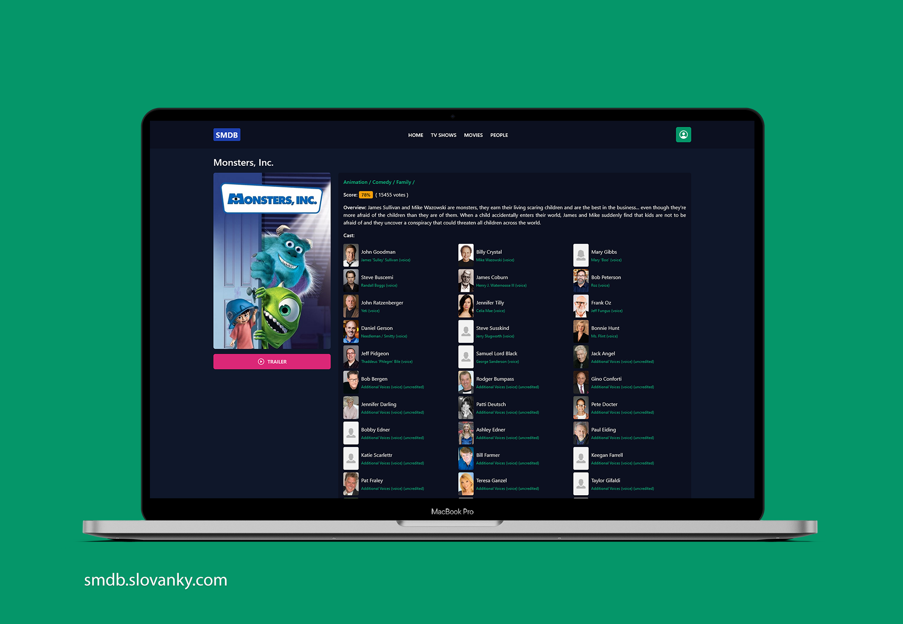
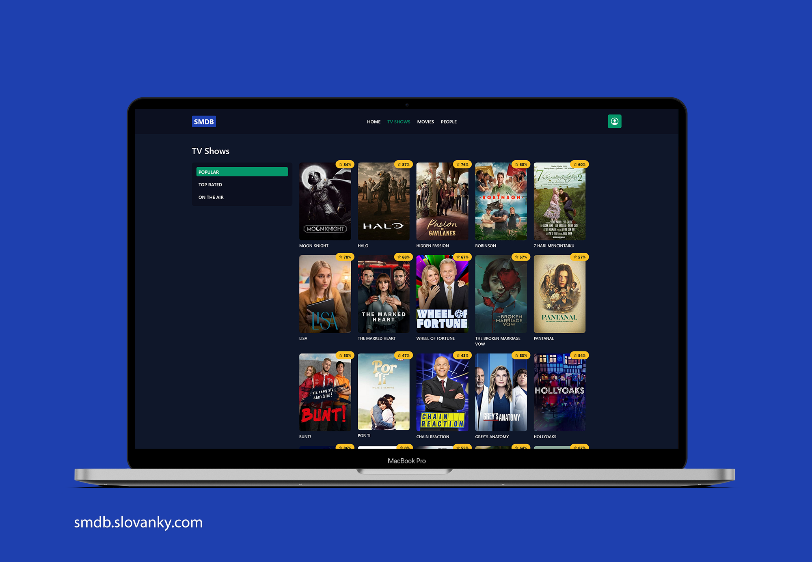
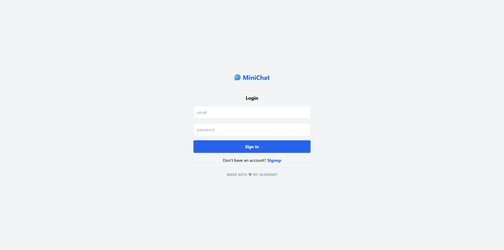

## Hi There - :wave: - I'm Peter Magdy (Slovanky)
- 

## Skills
01. **Web Development:**

02. **Web Design:**

03. **Graphic Design:**

## My Front-end Projects

01. https://smdb.slovanky.com/ ( 75% Completed ) ( VueJS - TailwindCSS - TMDB API - Firebase )

02. https://minichat.slovanky.com/ ( VueJS - TailwindCSS - Firebase )

03. https://unimaster-slovanky.netlify.app/
04. https://slovanky.github.io/portfolio/bezel/
05. https://slovanky.github.io/portfolio/alex/
06. https://slovanky-proj02.netlify.app/
07. https://slovanky-proj04.netlify.app/
08. https://slovanky-js01.netlify.app/
09. https://slovanky-js02.netlify.app/

